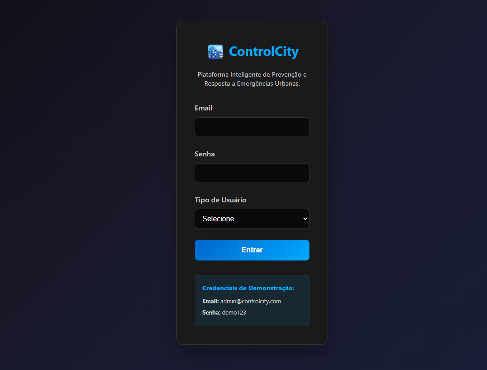
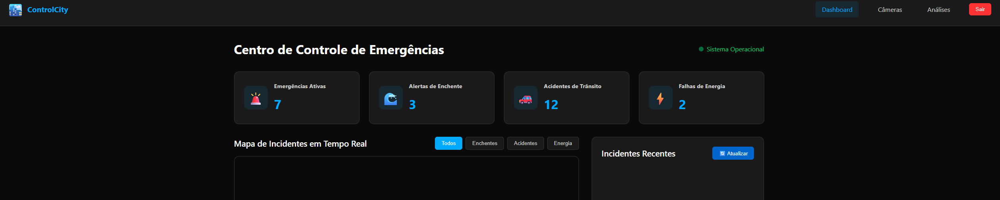
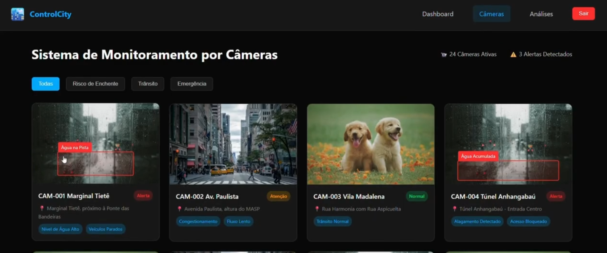
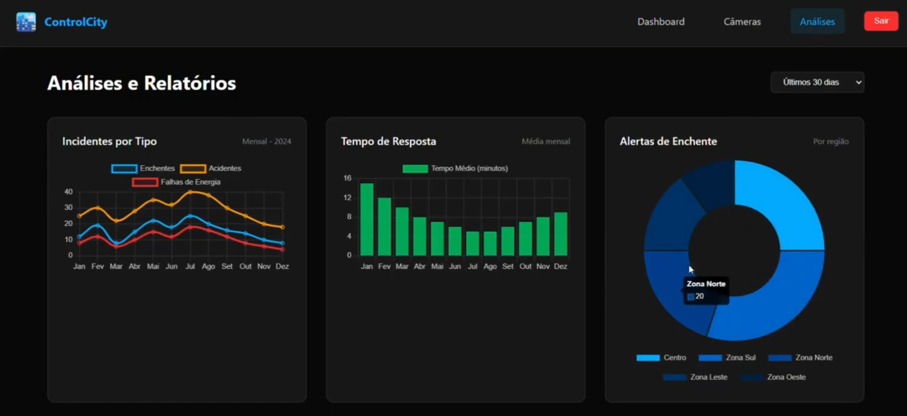

# ControlCity — Cidades ESG Inteligentes

Plataforma Inteligente de Prevenção e Resposta a Emergências Urbanas. Centraliza monitoramento de incidentes em tempo real (enchentes, acidentes de trânsito, falhas de energia) com mapa interativo, sistema de câmeras com detecção por IA e relatórios analíticos.

---

## Como executar localmente com Docker

### Pré-requisitos

- [Docker](https://www.docker.com/) e Docker Compose instalados
- Arquivo `.env` na raiz do projeto com as variáveis de ambiente

### Variáveis de ambiente

Crie um arquivo `.env` na raiz:

```env
POSTGRES_USER=admin
POSTGRES_PASSWORD=demo123
POSTGRES_DB=controlcity
```

### Subindo a aplicação

```bash
docker compose up --build
```

| Serviço    | URL                        | Descrição                          |
|------------|----------------------------|------------------------------------|
| Frontend   | http://localhost:8080      | Interface web servida pelo Nginx   |
| API        | http://localhost:3000      | Backend Node.js / Express          |
| Banco      | localhost:5432             | PostgreSQL 15                      |

### Credenciais de demonstração

| Campo  | Valor                    |
|--------|--------------------------|
| Email  | admin@controlcity.com    |
| Senha  | demo123                  |

### Encerrando

```bash
docker compose down
```

Para remover também o volume do banco de dados:

```bash
docker compose down -v
```

---

## Pipeline CI/CD

O projeto utiliza **GitHub Actions** com dois pipelines principais.

### Pipeline principal (`ci-cd.yml`)

Ativado em todo push para a branch `main`.

```
push → main
        │
        ▼
    [ test ]
    - Checkout do código
    - Setup Node.js 20
    - npm ci
    - npm test (Jest)
        │
        ▼
 [ build-and-push ]
    - Login no Docker Hub
    - docker build -t gustavosampa1o/controlcity:<sha> .
    - docker push → Docker Hub
        │
        ▼
 [ deploy-production ]
    - Restart da Azure Web App via API REST
    - Ambiente: brazilsouth-01.azurewebsites.net
```

**Secrets necessários no GitHub:**

| Secret                    | Descrição                        |
|---------------------------|----------------------------------|
| `DOCKERHUB_USERNAME`      | Usuário do Docker Hub            |
| `DOCKERHUB_TOKEN`         | Token de acesso do Docker Hub    |
| `AZURE_PUBLISH_PROFILE_USER`     | Usuário do Azure App Service |
| `AZURE_PUBLISH_PROFILE_PASSWORD` | Senha do Azure App Service   |

> O estágio `deploy-staging` está comentado no pipeline, aguardando provisionamento do ambiente de homologação no Azure.

### Pipeline Azure Static Web Apps (`azure-static-webapp.yml`)

Deploy automático do frontend estático no Azure Static Web Apps. Ativado em push para `main` e em pull requests.

---

## Containerização

### Dockerfile — build multi-stage

```dockerfile
# Estágio 1: build do frontend com Vite
FROM node:20-alpine AS builder
WORKDIR /app
COPY package*.json ./
RUN npm ci
COPY . .
RUN npm run build

# Estágio 2: servir os arquivos estáticos com Nginx
FROM nginx:alpine
COPY --from=builder /app/dist /usr/share/nginx/html
```

**Estratégias adotadas:**

- **Multi-stage build**: separa o ambiente de build do de produção, reduzindo o tamanho final da imagem (apenas os arquivos estáticos compilados são copiados para o Nginx).
- **Imagens Alpine**: `node:20-alpine` e `nginx:alpine` minimizam a superfície de ataque e o tamanho das imagens.
- **`npm ci`** no lugar de `npm install`: garante instalação determinística baseada no `package-lock.json`.

### Docker Compose — arquitetura dos serviços

```yaml
services:
  app:   # Frontend Nginx — porta 8080
  api:   # Backend Node.js — porta 3000
  db:    # PostgreSQL 15  — porta 5432
```

- O banco de dados é inicializado automaticamente via `init.sql` (script montado em `/docker-entrypoint-initdb.d/`).
- As credenciais do banco são injetadas via variáveis de ambiente (`.env`), sem hardcode na imagem.
- Volume nomeado `db_data` persiste os dados entre reinicializações.

---

## Prints do funcionamento

### Tela de Login

> Autenticação com validação de credenciais via API e banco PostgreSQL.



### Dashboard — Centro de Controle

> Mapa interativo de incidentes em tempo real com filtros por categoria (enchentes, acidentes, falhas de energia).



### Sistema de Câmeras

> Grade de 24 câmeras com detecções por IA. Modal com detalhes de localização, status e alertas detectados.



### Análises e Relatórios

> Gráficos históricos de incidentes, tempo de resposta e eficiência do sistema gerados com Chart.js.



---

## Tecnologias utilizadas

### Frontend

| Tecnologia    | Versão   | Uso                                        |
|---------------|----------|--------------------------------------------|
| HTML5 / CSS3  | —        | Estrutura e estilo das páginas             |
| JavaScript    | ES2022+  | Lógica client-side (módulos nativos)       |
| [Vite](https://vitejs.dev/) | 5.x | Bundler e servidor de desenvolvimento |
| [Leaflet](https://leafletjs.com/) | 1.9.4 | Mapas interativos de incidentes  |
| [Chart.js](https://www.chartjs.org/) | 4.4+ | Gráficos analíticos          |

### Backend

| Tecnologia    | Versão   | Uso                                        |
|---------------|----------|--------------------------------------------|
| Node.js       | 20 LTS   | Runtime do servidor                        |
| Express       | 5.x      | Framework HTTP / API REST                  |
| node-postgres (`pg`) | 8.x | Conexão com PostgreSQL              |
| CORS          | 2.x      | Política de origens cruzadas               |

### Banco de Dados

| Tecnologia    | Versão   | Uso                                        |
|---------------|----------|--------------------------------------------|
| PostgreSQL    | 15       | Persistência de usuários e dados           |

### Testes

| Tecnologia    | Versão   | Uso                                        |
|---------------|----------|--------------------------------------------|
| Jest          | 30.x     | Testes unitários da lógica de autenticação |
| jest-environment-jsdom | 30.x | Ambiente de teste browser        |

### Infraestrutura e DevOps

| Tecnologia              | Uso                                            |
|-------------------------|------------------------------------------------|
| Docker                  | Containerização da aplicação                   |
| Docker Compose          | Orquestração local dos serviços                |
| GitHub Actions          | CI/CD automatizado                             |
| Docker Hub              | Registro de imagens de container               |
| Azure Web App           | Hospedagem do backend em produção (Brazil South)|
| Azure Static Web Apps   | Hospedagem do frontend estático                |
